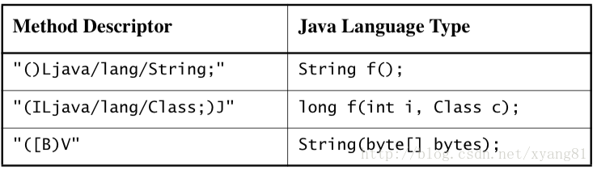
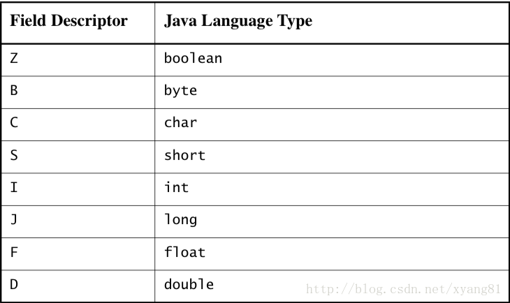

# C/C++ 访问 Java 实例方法和静态方法

通过前面 5 章的学习，我们知道了如何通过 JNI 函数来访问 JVM 中的基本数据类型、字符串和数组这些数据类型。下一步我们来学习本地代码如何与 JVM 中任意对象的属性和方法进行交互。比如本地代码调用 Java 层某个对象的方法或属性，也就是通常我们所说的来自 C/C++层本地函数的 callback（回调）。这个知识点分 2 篇文章分别介绍，本篇先介绍方法回调，在第七章中介绍本地代码访问 Java 的属性。

在这之前，先回顾一下在 Java 中调用一个方法时在 JVM 中的实现原理，有助于下面讲解本地代码调用 Java 方法实现的机制。写过 Java 的童鞋都知道，调用一个类的静态方法，直接通过`类名.方法`就可以调用。这也太简单了，有什么好讲的呢。但在这个调用过程中，JVM 是帮我们做了很多工作的。当我们在运行一个 Java 程序时，JVM 会先将程序运行时所要用到所有相关的 class 文件加载到 JVM 中，并采用按需加载的方式加载，也就是说某个类只有在被用到的时候才会被加载，这样设计的目的也是为了提高程序的性能和节约内存。所以我们在用类名调用一个静态方法之前，JVM 首先会判断该类是否已经加载，如果没有被 ClassLoader 加载到 JVM 中，JVM 会从classpath 路径下查找该类，如果找到了，会将其加载到 JVM 中，然后才是调用该类的静态方法。如果没有找到，JVM 会抛出 java.lang.ClassNotFoundException 异常，提示找不到这个类。ClassLoader 是 JVM 加载class 字节码文件的一种机制，不太了解的童鞋，请移步阅读[《深入分析Java ClassLoader原理》](http://blog.csdn.net/xyang81/article/details/7292380)一文。其实在 JNI 开发当中，本地代码也是按照上面的流程来访问类的静态方法或实例方法的，下面通过一个例子，详细介绍本地代码调用 Java 方法流程当中的每个步聚：

```
package com.study.jnilearn;  
  
/** 
 * AccessMethod.java 
 * 本地代码访问类的实例方法和静态方法 
 * @author yangxin 
 */  
public class AccessMethod {  
      
    public static native void callJavaStaticMethod();   
    public static native void callJavaInstaceMethod();  
      
    public static void main(String[] args) {  
        callJavaStaticMethod();  
        callJavaInstaceMethod();  
    }  
      
    static {  
        System.loadLibrary("AccessMethod");  
    }  
}  
```

```
package com.study.jnilearn;  
  
/** 
 * ClassMethod.java 
 * 用于本地代码调用 
 * @author yangxin 
 */  
public class ClassMethod {  
      
    private static void callStaticMethod(String str, int i) {  
        System.out.format("ClassMethod::callStaticMethod called!-->str=%s," +  
                " i=%d\n", str, i);  
    }  
      
    private void callInstanceMethod(String str, int i) {  
        System.out.format("ClassMethod::callInstanceMethod called!-->str=%s, " +  
                "i=%d\n", str, i);  
    }  
}  
```

由AccessMethod.class生成的头文件

```
/* DO NOT EDIT THIS FILE - it is machine generated */  
#include <jni.h>  
/* Header for class com_study_jnilearn_AccessMethod */  
  
#ifndef _Included_com_study_jnilearn_AccessMethod  
#define _Included_com_study_jnilearn_AccessMethod  
#ifdef __cplusplus  
extern "C" {  
#endif  
/* 
 * Class:     com_study_jnilearn_AccessMethod 
 * Method:    callJavaStaticMethod 
 * Signature: ()V 
 */  
JNIEXPORT void JNICALL Java_com_study_jnilearn_AccessMethod_callJavaStaticMethod  
  (JNIEnv *, jclass);  
  
/* 
 * Class:     com_study_jnilearn_AccessMethod 
 * Method:    callJavaInstaceMethod 
 * Signature: ()V 
 */  
JNIEXPORT void JNICALL Java_com_study_jnilearn_AccessMethod_callJavaInstaceMethod  
  (JNIEnv *, jclass);  
  
#ifdef __cplusplus  
}  
#endif  
#endif  
```

本地代码对头文件中函数原型的实现

```
// AccessMethod.c  
  
#include "com_study_jnilearn_AccessMethod.h"  
  
/* 
 * Class:     com_study_jnilearn_AccessMethod 
 * Method:    callJavaStaticMethod 
 * Signature: ()V 
 */  
JNIEXPORT void JNICALL Java_com_study_jnilearn_AccessMethod_callJavaStaticMethod  
(JNIEnv *env, jclass cls)  
{  
    jclass clazz = NULL;  
    jstring str_arg = NULL;  
    jmethodID mid_static_method;  
    // 1、从classpath路径下搜索ClassMethod这个类，并返回该类的Class对象  
    clazz =(*env)->FindClass(env,"com/study/jnilearn/ClassMethod");  
    if (clazz == NULL) {  
        return;  
    }  
      
    // 2、从clazz类中查找callStaticMethod方法  
    mid_static_method = (*env)->GetStaticMethodID(env,clazz,"callStaticMethod","(Ljava/lang/String;I)V");  
    if (mid_static_method == NULL) {  
        printf("找不到callStaticMethod这个静态方法。");  
        return;  
    }  
      
    // 3、调用clazz类的callStaticMethod静态方法  
    str_arg = (*env)->NewStringUTF(env,"我是静态方法");  
    (*env)->CallStaticVoidMethod(env,clazz,mid_static_method, str_arg, 100);  
      
    // 删除局部引用  
    (*env)->DeleteLocalRef(env,clazz);  
    (*env)->DeleteLocalRef(env,str_arg);  
}  
  
/* 
 * Class:     com_study_jnilearn_AccessMethod 
 * Method:    callJavaInstaceMethod 
 * Signature: ()V 
 */  
JNIEXPORT void JNICALL Java_com_study_jnilearn_AccessMethod_callJavaInstaceMethod  
(JNIEnv *env, jclass cls)  
{  
    jclass clazz = NULL;  
    jobject jobj = NULL;  
    jmethodID mid_construct = NULL;  
    jmethodID mid_instance = NULL;  
    jstring str_arg = NULL;  
    // 1、从classpath路径下搜索ClassMethod这个类，并返回该类的Class对象  
    clazz = (*env)->FindClass(env, "com/study/jnilearn/ClassMethod");  
    if (clazz == NULL) {  
        printf("找不到'com.study.jnilearn.ClassMethod'这个类");  
        return;  
    }  
      
    // 2、获取类的默认构造方法ID  
    mid_construct = (*env)->GetMethodID(env,clazz, "<init>","()V");  
    if (mid_construct == NULL) {  
        printf("找不到默认的构造方法");  
        return;  
    }  
      
    // 3、查找实例方法的ID  
    mid_instance = (*env)->GetMethodID(env, clazz, "callInstanceMethod", "(Ljava/lang/String;I)V");  
    if (mid_instance == NULL) {  
          
        return;  
    }  
      
    // 4、创建该类的实例  
    jobj = (*env)->NewObject(env,clazz,mid_construct);  
    if (jobj == NULL) {  
        printf("在com.study.jnilearn.ClassMethod类中找不到callInstanceMethod方法");  
        return;  
    }  
      
    // 5、调用对象的实例方法  
    str_arg = (*env)->NewStringUTF(env,"我是实例方法");  
    (*env)->CallVoidMethod(env,jobj,mid_instance,str_arg,200);  
      
    // 删除局部引用  
    (*env)->DeleteLocalRef(env,clazz);  
    (*env)->DeleteLocalRef(env,jobj);  
    (*env)->DeleteLocalRef(env,str_arg);  
}  
```

运行结果：

```
ClassMethod::callStaticMethod called!-->str==我是静态方法,i=100
ClassMethod::callInstanceMethod called!-->str==我是实例方法,i=200
```

## 代码解析：

AccessMethod.java 是程序的入口，在 main 方法中，分别调用了 callJavaStaticMethod 和callJavaInstaceMethod 这两个 native 方法，用于测试 native 层调用 MethodClass.java 中的callStaticMethod 静态方法和 callInstanceMethod 实例方法，这两个方法的返回值都为 Void，参数都有两个，分别为 String 和 int。

### callJavaStaticMethod 静态方法实现说明

```
JNIEXPORT void JNICALL Java_com_study_jnilearn_AccessMethod_callJavaStaticMethod  
(JNIEnv *env, jclass cls)  
```

定位到AccessMethod.c的代码

```
(*env)->CallStaticVoidMethod(env,clazz,mid_static_method, str_arg, 100); 
```

CallStaticVoidMethod函数的原型如下

```
void (JNICALL *CallStaticVoidMethod)(JNIEnv *env, jclass cls, jmethodID methodID, ...); 
```

该函数接收 4 个参数：

- env：JNI 函数表指针
- cls：调用该静态方法的 Class 对象
- methodID：方法 ID（因为一个类中会存在多个方法，需要一个唯一标识来确定调用类中的哪个方法） 
- 参数4：方法实参列表

根据函数参数的提示，分以下四步完成 Java 静态方法的回调：

第一步：调用 FindClass 函数，传入一个 Class 描述符，JVM 会从 classpath 路径下搜索该类，并返回jclass 类型（用于存储 Class 对象的引用）。注意 ClassMethod 的 Class 描述符为 com/study/jnilearn/ClassMethod，要将 \.（点）全部换成 /（反斜杠）。

```
(*env)->FindClass(env,"com/study/jnilearn/ClassMethod");  
```

第二步：调用 GetStaticMethodID 函数，从 ClassMethod 类中获取 callStaticMethod 方法 ID，返回jmethodID 类型（用于存储方法的引用）。实参 clazz 是第一步找到的 jclass 对象，实参"callStaticMethod"为方法名称，实参“(Ljava/lang/String;I)V”为方法的签名。

```
(*env)->GetStaticMethodID(env,clazz,"callStaticMethod","(Ljava/lang/String;I)V");  
```

第三步：调用 CallStaticVoidMethod 函数，执行 ClassMethod.callStaticMethod 方法调用。str_arg 和100 是 callStaticMethod 方法的实参。

```
str_arg = (*env)->NewStringUTF(env,"我是静态方法");  
(*env)->CallStaticVoidMethod(env,clazz,mid_static_method, str_arg, 100);  
```

注意：JVM 针对所有数据类型的返回值都定义了相关的函数。上面 callStaticMethod 方法的返回类型为 void，所以调用 CallStaticVoidMethod。根据返回值类型不同，JNI 提供了一系列不同返回值的函数，如：CallStaticIntMethod、CallStaticFloatMethod、CallStaticShortMethod、CallStaticObjectMethod等，分别表示调用返回值为 int、float、short、Object 类型的函数，引用类型统一调用CallStaticObjectMethod 函数。另外，每种返回值类型的函数都提供了接收3种实参类型的实现：CallStaticXXXMethod(env, clazz, methodID, ...)，CallStaticXXXMethodV(env, clazz, methodID, va_list args)，CallStaticXXXMethodA(env, clazz, methodID, const jvalue *args)，分别表示：接收可变参数列表、接收 va_list 作为实参和接收`const jvalue*`为实参。下面是`jni.h`头文件中CallStaticVoidMethod 的三种实参的函数原型：

```
void (JNICALL *CallStaticVoidMethod)  
     (JNIEnv *env, jclass cls, jmethodID methodID, ...);  
   void (JNICALL *CallStaticVoidMethodV)  
     (JNIEnv *env, jclass cls, jmethodID methodID, va_list args);  
   void (JNICALL *CallStaticVoidMethodA)  
     (JNIEnv *env, jclass cls, jmethodID methodID, const jvalue * args);  
```

第四步：释放局部变量

```
// 删除局部引用  
(*env)->DeleteLocalRef(env,clazz);  
(*env)->DeleteLocalRef(env,str_arg);  
```

虽然函数结束后，JVM 会自动释放所有局部引用变量所占的内存空间。但还是手动释放一下比较安全，因为在 JVM 中维护着一个引用表，用于存储局部和全局引用变量，经测试在 Android NDK 环境下，这个表的最大存储空间是512 个引用，如果超过这个数就会造成引用表溢出，JVM 崩溃。在 PC 环境下测试，不管申请多少局部引用也不释放都不会崩，我猜可能与 JVM 和 Android Dalvik 虚拟机实现方式不一样的原因。所以有申请就及时释放是一个好的习惯！（局部引用和全局引用在后面的文章中会详细介绍）

### callInstanceMethod实例方法实现说明

```
JNIEXPORT void JNICALL Java_com_study_jnilearn_AccessMethod_callJavaInstaceMethod  
(JNIEnv *env, jclass cls) 
```

定位到AccessMethod.c的代码：

```
(*env)->CallVoidMethod(env,jobj,mid_instance,str_arg,200);  
```

CallVoidMethod函数的原型如下

```
void (JNICALL *CallVoidMethod) (JNIEnv *env, jobject obj, jmethodID methodID, ...);  
```

该函数接收 4 个参数：
- env：JNI 函数表指针
- obj：调用该方法的实例
- methodID：方法 ID 
- 参数4：方法的实参列表

根据函数参数的提示，分以下六步完成 Java 静态方法的回调：

第一步：同调用静态方法一样，首先通过 FindClass 函数获取类的 Class 对象。

第二步：获取类的构造方法 ID，因为创建类的对象首先会调用类的构造方法。这里以默认构造方法为例。

```
(*env)->GetMethodID(env,clazz, "<init>","()V");  
```

`<init>`代表类的构造方法名称，`()V`代表无参无返回值的构造方法（即默认构造方法）

第三步：调用 GetMethodID 获取 callInstanceMethod 的方法 ID。

```
(*env)->GetMethodID(env, clazz, "callInstanceMethod", "(Ljava/lang/String;I)V");  
```

第四步：调用 NewObject 函数，创建类的实例对象。

```
<span style="font-size:18px;">(*env)->NewObject(env,clazz,mid_construct);</span>  
```

第五步：调用 CallVoidMethod 函数，执行 ClassMethod.callInstanceMethod 方法调用，str_arg 和 200是方法实参。

```
str_arg = (*env)->NewStringUTF(env,"我是实例方法");  
(*env)->CallVoidMethod(env,jobj,mid_instance,str_arg,200); 
```

同 JNI 调用 Java 静态方法一样，JVM 针对所有数据类型的返回值都定义了相关的函数（CallXXXMethod），如：CallIntMethod、CallFloatMethod、CallObjectMethod 等，也同样提供了支持三种类型实参的函数实现，以 CallVoidMethod 为例，如下是`jni.h`头文件中该函数的原型：

```
void (JNICALL *CallVoidMethod)(JNIEnv *env, jobject obj, jmethodID methodID, ...);  
void (JNICALL *CallVoidMethodV)(JNIEnv *env, jobject obj, jmethodID methodID, va_list args);  
void (JNICALL *CallVoidMethodA)(JNIEnv *env, jobject obj, jmethodID methodID, const jvalue * args);  
```

第六步：删除局部引用（从引用表中移除）。

```
// 删除局部引用  
(*env)->DeleteLocalRef(env,clazz);  
(*env)->DeleteLocalRef(env,jobj);  
(*env)->DeleteLocalRef(env,str_arg); 
```

### 方法签名

在上面的的例子中，无论是调用静态方法还是实例方法，都必须传入一个 jmethodID 的参数。因为在 Java 中存在方法重载（方法名相同，参数列表不同），所以要明确告诉 JVM 调用的是类或实例中的哪一个方法。调用 JNI 的 GetMethodID 函数获取一个 jmethodID 时，需要传入一个方法名称和方法签名，方法名称就是在 Java 中定义的方法名，方法签名的格式为：(形参参数类型列表)返回值。形参参数列表中，引用类型以 L 开头，后面紧跟类的全路径名（需将`.`全部替换成`/`），以分号结尾。下面是一些示例：



Java 基本类型与方法签名中参数类型和返回值类型的映射关系如下：



比如，`String fun(int a, float b, boolean c, String d) `对应的 JNI 方法签名为：`"(IFZLjava/lang/String;)Ljava/lang/String;"`。

## 总结：

- 调用静态方法使用 CallStaticXXXMethod/V/A 函数，XXX 代表返回值的数据类型。如：CallStaticIntMethod
- 调用实例方法使用 CallXXXMethod/V/A 函数，XXX 代表返回的数据类型，如：CallIntMethod
- 获取一个实例方法的 ID，使用 GetMethodID 函数，传入方法名称和方法签名
- 获以一个静态方法的 ID，使用 GetStaticMethodID 函数，传入方法名称和方法签名
- 获取构造方法 ID，方法名称使用"<init>"
- 获取一个类的 Class 实例，使用 FindClass 函数，传入类描述符。JVM 会从 classpath 目录下开始搜索。
- 创建一个类的实例，使用 NewObject 函数，传入 Class 引用和构造方法 ID
- 删除局部变量引用，使用 DeleteLocalRef，传入引用变量
- 方法签名格式：(形参参数列表)返回值类型。注意：形参参数列表之间不需要用空格或其它字符分隔
- 类描述符格式：L 包名路径/类名;，包名之间用/分隔。如：Ljava/lang/String;
- 调用 GetMethodID 获取方法 ID 和调用 FindClass 获取 Class 实例后，要做异常判断

示例代码下载地址：[https://code.csdn.net/xyang81/jnilearn](https://code.csdn.net/xyang81/jnilearn)


