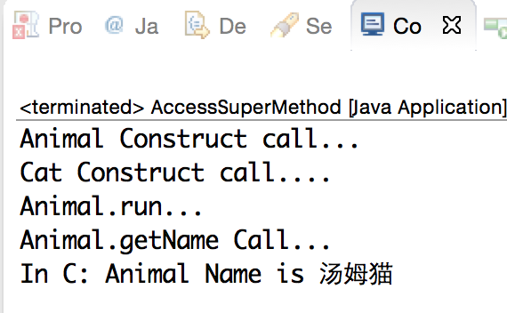

# JNI 调用构造方法和父类实例方法

在前面我们学习到了在 Native 层如何调用 Java 静态方法和实例方法，其中调用实例方法的示例代码中也提到了调用构造函数来实始化一个对象，但没有详细介绍，一带而过了。还没有阅读过的同学请移步《JNI——C/C++ 访问 Java 实例方法和静态方法》阅读。这章详细来介绍下初始一个对象的两种方式，以及如何调用子类对象重写的父类实例方法。


## 构造方法和父类实例方法

我们先回过一下，在 Java 中实例化一个对象和调用父类实例方法的流程。先看一段代码：

```
package com.study.jnilearn;
public class Animal {
    public void run() {
        System.out.println("Animal.run...");
    }
}

package com.study.jnilearn;
public class Cat extends Animal {
    @Override
    public void run() {
        System.out.println(name + " Cat.run...");
    }
}

public static void main(String[] args) {
    Animal cat = new Cat("汤姆");
    cat.run();
}
```

正如你所看到的那样，上面这段代码非常简单，有两个类 Animal 和 Cat，Animal 类中定义了 run 和 getName 两个方法，Cat 继承自 Animal，并重写了父类的 run 方法。在 main 方法中，首先定义了一个 Animal 类型的变量 cat，并指向了 Cat 类的实例对象，然后调用了它的 run 方法。**在执行 new Cat(“汤姆”)这段代码时，会先为 Cat 类分配内存空间（所分配的内存空间大小由 Cat 类的成员变量数量决定），然后调用 Cat 的带参构造方法初始化对象。** cat 是 Animal 类型，但它指向的是 Cat 实例对象的引用，而且 Cat 重写了父类的 run 方法，因为调用 run 方法时有多态存在，所以访问的是 Cat 的 run 而非 Animal 的 run，运行后打印的结果为：`汤姆 Cat.run… `

如果要调用父类的 run 方法，只需在 Cat 的 run 方法中调用 super.run() 即可，相当的简单。

写过 C 或 C++ 的同学应该都有一个很深刻的内存管理概念，栈空间和堆空间，栈空间的内存大小受操作系统限制，由操作系统自动来管理，速度较快，所以在函数中定义的局部变量、函数形参变量都存储在栈空间。操作系统没有限制堆空间的内存大小，只受物理内存的限制，内存需要程序员自己管理。在 C 语言中用 malloc 关键字动态分配的内存和在 C++ 中用 new 创建的对象所分配内存都存储在堆空间，内存使用完之后分别用`free`或`delete/delete[]`释放。这里不过多的讨论 C/C++ 内存管理方面的知识，有兴趣的同学请自行百度。做 Java 的童鞋众所周知，写 Java 程序是不需要手动来管理内存的，内存管理那些烦锁的事情全都交由一个叫 GC 的线程来管理（当一个对象没有被其它对象所引用时，该对象就会被 GC 释放）。但我觉得 Java 内部的内存管理原理和 C/C++ 是非常相似的，上例中，`Animal cat = new Cat(“汤姆”); `局部变量 cat 存放在栈空间上，new Cat (“汤姆”);创建的实例对象存放在堆空间，返回一个内存地址的引用，存储在 cat 变量中。这样就可以通过 cat 变量所指向的引用访问 Cat 实例当中所有可见的成员了。

所以创建一个对象分为 2 步：
 
- 为对象分配内存空间 
- 初始化对象（调用对象的构造方法）

下面通过一个示例来了解在 JNI 中是如何调用对象构造方法和父类实例方法的。为了让示例能清晰的体现构造方法和父类实例方法的调用流程，定义了 Animal 和 Cat 两个类，Animal 定义了一个 String 形参的构造方法，一个成员变量 name、两个成员函数 run 和 getName，Cat 继承自 Animal，并重写了 run 方法。在 JNI 中实现创建 Cat 对象的实例，调用 Animal 类的 run 和 getName 方法。代码如下所示。

```
// Animal.java
package com.study.jnilearn;
public class Animal {

    protected String name;

    public Animal(String name) {
        this.name = name;
        System.out.println("Animal Construct call...");
    }

    public String getName() {
        System.out.println("Animal.getName Call...");
        return this.name;
    }

    public void run() {
        System.out.println("Animal.run...");
    }   
}

// Cat.java
package com.study.jnilearn;
public class Cat extends Animal {

    public Cat(String name) {
        super(name);
        System.out.println("Cat Construct call....");
    }

    @Override
    public String getName() {
        return "My name is " + this.name;
    }

    @Override
    public void run() {
        System.out.println(name + " Cat.run...");
    }
}

// AccessSuperMethod.java
package com.study.jnilearn;
public class AccessSuperMethod {

    public native static void callSuperInstanceMethod(); 

    public static void main(String[] args) {
        callSuperInstanceMethod();
    }

    static {
        System.loadLibrary("AccessSuperMethod");
    }
}
```

AccessSuperMethod 类是程序的入口，其中定义了一个 native 方法 callSuperInstanceMethod。用 javah 生成的 jni 函数原型如下。

```
/* Header for class com_study_jnilearn_AccessSuperMethod */

#ifndef _Included_com_study_jnilearn_AccessSuperMethod
#define _Included_com_study_jnilearn_AccessSuperMethod
#ifdef __cplusplus
extern "C" {
#endif
/*
 * Class:     com_study_jnilearn_AccessSuperMethod
 * Method:    callSuperInstanceMethod
 * Signature: ()V
 */
JNIEXPORT void JNICALL Java_com_study_jnilearn_AccessSuperMethod_callSuperInstanceMethod
  (JNIEnv *, jclass);

#ifdef __cplusplus
}
#endif
#endif
```

实现 Java_com_study_jnilearn_AccessSuperMethod_callSuperInstanceMethod 函数，如下所示。

```
/ AccessSuperMethod.c

#include "com_study_jnilearn_AccessSuperMethod.h"

JNIEXPORT void JNICALL Java_com_study_jnilearn_AccessSuperMethod_callSuperInstanceMethod
  (JNIEnv *env, jclass cls)
{
    jclass cls_cat;
    jclass cls_animal;
    jmethodID mid_cat_init;
    jmethodID mid_run;
    jmethodID mid_getName;
    jstring c_str_name;
    jobject obj_cat;
    const char *name = NULL;

    // 1、获取Cat类的class引用
    cls_cat = (*env)->FindClass(env, "com/study/jnilearn/Cat");
    if (cls_cat == NULL) {
        return;
    }

    // 2、获取Cat的构造方法ID(构造方法的名统一为：<init>)
    mid_cat_init = (*env)->GetMethodID(env, cls_cat, "<init>", "(Ljava/lang/String;)V");
    if (mid_cat_init == NULL) {
        return; // 没有找到只有一个参数为String的构造方法
    }

    // 3、创建一个String对象，作为构造方法的参数
    c_str_name = (*env)->NewStringUTF(env, "汤姆猫");
    if (c_str_name == NULL) {
        return; // 创建字符串失败（内存不够）
    }

    //  4、创建Cat对象的实例(调用对象的构造方法并初始化对象)
    obj_cat = (*env)->NewObject(env,cls_cat, mid_cat_init,c_str_name);
    if (obj_cat == NULL) {
        return;
    }

    //-------------- 5、调用Cat父类Animal的run和getName方法 --------------
    cls_animal = (*env)->FindClass(env, "com/study/jnilearn/Animal");
    if (cls_animal == NULL) {
        return;
    }

    // 例1： 调用父类的run方法
    mid_run = (*env)->GetMethodID(env, cls_animal, "run", "()V");    // 获取父类Animal中run方法的id
    if (mid_run == NULL) {
        return;
    }

    // 注意：obj_cat是Cat的实例，cls_animal是Animal的Class引用，mid_run是Animal类中的方法ID
    (*env)->CallNonvirtualVoidMethod(env, obj_cat, cls_animal, mid_run);

    // 例2：调用父类的getName方法
    // 获取父类Animal中getName方法的id
    mid_getName = (*env)->GetMethodID(env, cls_animal, "getName", "()Ljava/lang/String;");
    if (mid_getName == NULL) {
        return;
    }

    c_str_name = (*env)->CallNonvirtualObjectMethod(env, obj_cat, cls_animal, mid_getName);
    name = (*env)->GetStringUTFChars(env, c_str_name, NULL);
    printf("In C: Animal Name is %s\n", name);

    // 释放从java层获取到的字符串所分配的内存
    (*env)->ReleaseStringUTFChars(env, c_str_name, name);

quit:
    // 删除局部引用（jobject或jobject的子类才属于引用变量），允许VM释放被局部变量所引用的资源
    (*env)->DeleteLocalRef(env, cls_cat);
    (*env)->DeleteLocalRef(env, cls_animal);
    (*env)->DeleteLocalRef(env, c_str_name);
    (*env)->DeleteLocalRef(env, obj_cat);
}
```

运行结果



## 代码讲解 - 调用构造方法

调用构造方法和调用对象的实例方法方式是相似的，传入”< init >”作为方法名查找类的构造方法ID，然后调用JNI函数NewObject调用对象的构造函数初始化对象。如下代码所示。

```
obj_cat = (*env)->NewObject(env,cls_cat,mid_cat_init,c_str_name);
```

上述这段代码调用了 JNI 函数 NewObject 创建了 Class 引用的一个实例对象。这个函数做了 2 件事情

- 创建一个未初始化的对象并分配内存空间 
- 调用对象的构造函数初始化对象。这两步也可以分开进行，为对象分配内存，然后再初始化对象，如下代码所示：

```
 // 1、创建一个未初始化的对象，并分配内存
 obj_cat = (*env)->AllocObject(env, cls_cat);
 if (obj_cat) {
    // 2、调用对象的构造函数初始化对象
    (*env)->CallNonvirtualVoidMethod(env,obj_cat, cls_cat, mid_cat_init, c_str_name);
    if ((*env)->ExceptionCheck(env)) { // 检查异常
        goto quit;
    }
 }
```

AllocObject 函数创建的是一个未初始化的对象，后面在用这个对象之前，必须调用CallNonvirtualVoidMethod 调用对象的构造函数初始化该对象。而且在使用时一定要非常小心，确保在一个对象上面，构造函数最多被调用一次。有时，先创建一个初始化的对象，然后在合适的时间再调用构造函数的方式是很有用的。尽管如此，大部分情况下，应该使用 NewObject，尽量避免使用容易出错的 AllocObject/CallNonvirtualVoidMethod 函数。


## 代码讲解 - 调用父类实例方法

如果一个方法被定义在父类中，在子类中被覆盖，也可以调用父类中的这个实例方法。JNI 提供了一系列函数CallNonvirtualXXXMethod 来支持调用各种返回值类型的实例方法。调用一个定义在父类中的实例方法，须遵循下面的步骤。

使用 GetMethodID 函数从一个指向父类的 Class 引用当中获取方法 ID。

```
cls_animal = (*env)->FindClass(env, "com/study/jnilearn/Animal");
if (cls_animal == NULL) {
    return;
}

//例1： 调用父类的run方法
mid_run = (*env)->GetMethodID(env, cls_animal, "run", "()V");    // 获取父类Animal中run方法的id
if (mid_run == NULL) {
    return;
}
```

传入子类对象、父类 Class 引用、父类方法 ID 和参数，并调用 CallNonvirtualVoidMethod、 
CallNonvirtualBooleanMethod、CallNonvirtualIntMethod 等一系列函数中的一个。其中CallNonvirtualVoidMethod 也可以被用来调用父类的构造函数。

```
// 注意：obj_cat是Cat的实例，cls_animal是Animal的Class引用，mid_run是Animal类中的方法ID
(*env)->CallNonvirtualVoidMethod(env, obj_cat, cls_animal, mid_run);
```
其实在开发当中，这种调用父类实例方法的情况是很少遇到的，通常在 JAVA 中可以很简单地做到: `super.func()`;但有些特殊需求也可能会用到，所以知道有这么回事还是很有必要的。

