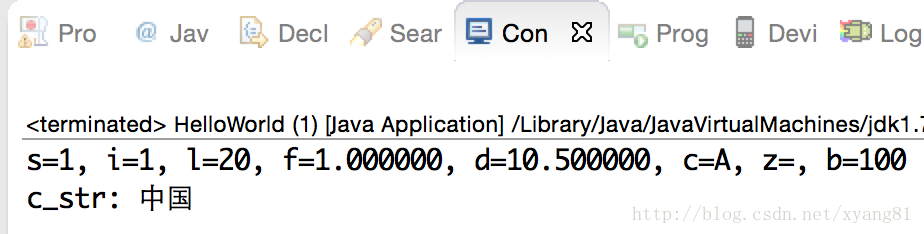
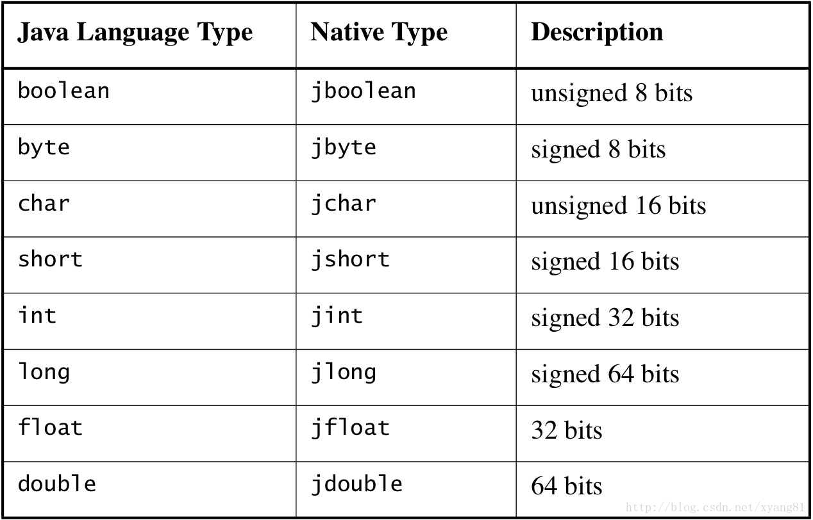
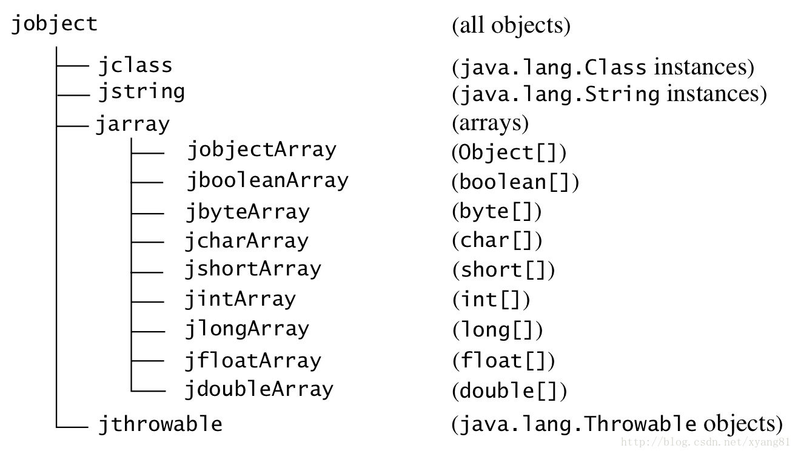

# JNI 数据类型与 Java 数据类型的映射关系

当我们在调用一个 Java native 方法的时候，方法中的参数是如何传递给 C/C++ 本地函数中的呢？Java 方法中的参数与 C/C++ 函数中的参数，它们之间是怎么转换的呢？我猜你应该也有相关的疑虑吧，咱们先来看一个例子，还是以 HelloWorld 为例：

HelloWorld.java：

```
package com.study.jnilearn;  
  
class MyClass {}  
  
public class HelloWorld {  
      
    public static native void test(short s, int i, long l, float f, double d, char c,   
            boolean z, byte b, String str, Object obj, MyClass p, int[] arr);  
  
    public static void main(String[] args) {  
        String obj = "obj";  
        short s = 1;  
        long l = 20;  
        byte b = 127;  
        test(s, 1, l, 1.0f, 10.5, 'A', true, b, "中国", obj, new MyClass(), new int[] {});  
    }  
      
    static {  
        System.loadLibrary("HelloWorld");  
    }  
}  
```

在 HelloWorld.java 中定义了一个 test 的 native 方法，该方法中一个共有 12 个参数，其中前面 8 个为基本数据类型，后面 4 个全部为引用类型。

由 HelloWorld.class 生成的 native 函数原型及实现：

```
/* 
 * Class:     com_study_jnilearn_HelloWorld 
 * Method:    test 
 * Signature: (SIJFDCZBLjava/lang/String;Ljava/lang/Object;Lcom/study/jnilearn/MyClass;[I)V 
 */  
JNIEXPORT void JNICALL Java_com_study_jnilearn_HelloWorld_test  
    (JNIEnv *env, jclass cls, jshort s, jint i, jlong l, jfloat f,  
     jdouble d, jchar c, jboolean z, jbyte b, jstring j_str, jobject jobj1, jobject job2, jintArray j_int_arr)  
{  
    printf("s=%hd, i=%d, l=%ld, f=%f, d=%lf, c=%c, z=%c, b=%d", s, i, l, f, d, c, z, b);  
    const char *c_str = NULL;  
    c_str = (*env)->GetStringUTFChars(env, j_str, NULL);  
    if (c_str == NULL)  
    {  
        return; // memory out  
    }  
    (*env)->ReleaseStringUTFChars(env, j_str, c_str);  
    printf("c_str: %s\n", (char*)c_str);  
}  
```

调用 test 方法的输出结果：




从头文件函数的原型可以得知，test 方法中形参的数据类型自动转换成了 JNI 中相应的数据类型，不难理解，在调用 Java native 方法将实参传递给 C/C++ 函数的时候，会自动将 java 形参的数据类型自动转换成 C/C++ 相应的数据类型，所以我们在写 JNI 程序的时候，必须要明白它们之间数据类型的对应关系。

在 Java 语言中数据类型分为基本数据类型和引用类型，其中基本数据类型有 8 种：byte、char、short、int、long、float、double、boolean，除了基本数据类型外其它都是引用类型：Object、String、数组等。8 种基本数据类型分别对应JNI数据类型中的 jbyte、jchar、jshort、jint、jlong、jfloat、jdouble、jboolean。所有的 JNI 引用类型全部是 jobject 类型，为了使用方便和类型安全，JNI 定义了一个引用类型集合，集合当中的所有类型都是 jobject 的子类，这些子类和 Java 中常用的引用类型相对应。例如：jstring 表示字符串、jclass 表示 class 字节码对象、jthrowable 表示异常、jarray 表示数组，另外 jarray 派生了 8 个子类，分别对应Java 中的 8 种基本数据类型（jintArray、jshortArray、jlongArray等）。下面再回顾头来看看 test 方法与`Java_com_study_jnilearn_HelloWorld_test`函数中参数类型的对应关系：

```
// HelloWorld.java  
public static native void test(short s, int i, long l, float f, double d, char c,   
            boolean z, byte b, String str, Object obj, MyClass p);  
  
// HelloWorld.h  
JNIEXPORT void JNICALL Java_com_study_jnilearn_HelloWorld_test  
  (JNIEnv *, jclass, jshort, jint, jlong, jfloat, jdouble, jchar, jboolean, jbyte, jstring, jobject, jobject, jintArray);  
```

从上面两个函数的参数中可以看出来，除了 JNIEnv 和 jclass 这两个参数外，其它参数都是一一对应的。下面是JNI 规范文档中描述 Java 与 JN I数据类型的对应关系：


基本数据类型：



引用类型：




JNI 如果使用 C++ 语言编写的话，所有引用类型派生自 jobject，使用 C++ 的继承结构特性，使用相应的类型。如下所示：

```
class _jobject {};  
   class _jclass : public _jobject {};  
   class _jstring : public _jobject {};  
   class _jarray : public _jobject {};  
   class _jbooleanArray : public _jarray {};  
   class _jbyteArray : public _jarray {};  
```

JNI 如果使用 C 语言编写的话，所有引用类型使用 jobject，其它引用类型使用 typedef 重新定义，如：typedef jobject jstring 。
jvalue 是一个 unio（联合）类型，在 C 语中为了节约内存，会用联合类型变量来存储声明在联合体中的任意类型数据 。在 JNI 中将基本数据类型与引用类型定义在一个联合类型中，表示用 jvalue 定义的变量，可以存储任意 JNI 类型的数据，后面会介绍 jvalue 在 JNI 编程当中的应用。原型如下：

```
typedef union jvalue {  
    jboolean z;  
    jbyte    b;  
    jchar    c;  
    jshort   s;  
    jint     i;  
    jlong    j;  
    jfloat   f;  
    jdouble  d;  
    jobject  l;  
} jvalue;  
```