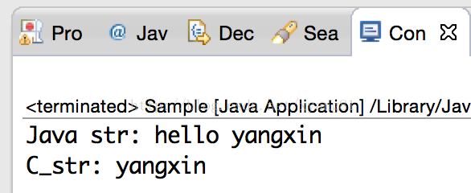

# JNI 字符串处理

## 处理字符串

从第三章中可以看出 JNI 中的基本类型和 Java 中的基本类型都是一一对应的，接下来先看一下 JNI 的基本类型定义：

```
typedef unsigned char   jboolean;  
typedef unsigned short  jchar;  
typedef short           jshort;  
typedef float           jfloat;  
typedef double          jdouble;  
typedef int jint;  
#ifdef _LP64 /* 64-bit Solaris */  
typedef long jlong;  
#else  
typedef long long jlong;  
#endif  
  
typedef signed char jbyte;  
```

基本类型很容易理解，就是对 C/C++ 中的基本类型用 typedef 重新定义了一个新的名字，在 JNI 中可以直接访问。JNI 把 Java 中的所有对象当作一个C指针传递到本地方法中，这个指针指向 JVM 中的内部数据结构，而内部的数据结构在内存中的存储方式是不可见的。只能从 JNIEnv 指针指向的函数表中选择合适的 JNI 函数来操作 JVM 中的数据结构。第三章的示例中，访问 java.lang.String 对应的 JNI 类型 jstring 时，没有像访问基本数据类型一样直接使用，因为它在 Java 是一个引用类型，所以在本地代码中只能通过 GetStringUTFChars 这样的 JNI 函数来访问字符串的内容。

下面先看一个例子：

Sample.java：

```
package com.study.jnilearn;  
  
public class Sample {  
      
    public native static String sayHello(String text);  
  
    public static void main(String[] args) {  
        String text = sayHello("yangxin");  
        System.out.println("Java str: " + text);  
    }  
      
    static {  
        System.loadLibrary("Sample");  
    }  
}  
```

com_study_jnilearn_Sample.h和Sample.c：

```
/* DO NOT EDIT THIS FILE - it is machine generated */  
#include <jni.h>  
/* Header for class com_study_jnilearn_Sample */  
  
#ifndef _Included_com_study_jnilearn_Sample  
#define _Included_com_study_jnilearn_Sample  
#ifdef __cplusplus  
extern "C" {  
#endif  
/* 
 * Class:     com_study_jnilearn_Sample 
 * Method:    sayHello 
 * Signature: (Ljava/lang/String;)Ljava/lang/String; 
 */  
JNIEXPORT jstring JNICALL Java_com_study_jnilearn_Sample_sayHello  
  (JNIEnv *, jclass, jstring);  
  
#ifdef __cplusplus  
}  
#endif  
#endif  
  
// Sample.c  
#include "com_study_jnilearn_Sample.h"  
/* 
 * Class:     com_study_jnilearn_Sample 
 * Method:    sayHello 
 * Signature: (Ljava/lang/String;)Ljava/lang/String; 
 */  
JNIEXPORT jstring JNICALL Java_com_study_jnilearn_Sample_sayHello  
  (JNIEnv *env, jclass cls, jstring j_str)  
{  
    const char *c_str = NULL;  
    char buff[128] = {0};  
    jboolean isCopy;    // 返回JNI_TRUE表示原字符串的拷贝，返回JNI_FALSE表示返回原字符串的指针  
    c_str = (*env)->GetStringUTFChars(env, j_str, &isCopy);  
    printf("isCopy:%d\n",isCopy);  
    if(c_str == NULL)  
    {  
        return NULL;  
    }  
    printf("C_str: %s \n", c_str);  
    sprintf(buff, "hello %s", c_str);  
    (*env)->ReleaseStringUTFChars(env, j_str, c_str);  
    return (*env)->NewStringUTF(env,buff);  
}  
```

运行结果如下：




## 示例解析

### 访问字符串

sayHello 函数接收一个 jstring 类型的参数 text，但 jstring 类型是指向 JVM 内部的一个字符串，和 C 风格的字符串类型 char* 不同，所以在 JNI 中不能通把 jstring 当作普通 C 字符串一样来使用，必须使用合适的 JNI 函数来访问 JVM 内部的字符串数据结构。

GetStringUTFChars(env, j_str, &isCopy) 参数说明：

- env：JNIEnv 函数表指针
- j_str：jstring 类型（Java 传递给本地代码的字符串指针）
- isCopy：取值 JNI_TRUE 和 JNI_FALSE，如果值为 JNI_TRUE，表示返回 JVM 内部源字符串的一份拷贝，并为新产生的字符串分配内存空间。如果值为 JNI_FALSE，表示返回 JVM 内部源字符串的指针，意味着可以通过指针修改源字符串的内容，不推荐这么做，因为这样做就打破了 Java 字符串不能修改的规定。但我们在开发当中，并不关心这个值是多少，通常情况下这个参数填 NULL 即可。

因为 Java 默认使用 Unicode 编码，而 C/C++ 默认使用 UTF 编码，所以在本地代码中操作字符串的时候，必须使用合适的 JNI 函数把 jstring 转换成 C 风格的字符串。JNI 支持字符串在 Unicode 和 UTF-8 两种编码之间转换，GetStringUTFChars 可以把一个 jstring 指针（指向 JVM 内部的 Unicode 字符序列）转换成一个UTF-8 格式的 C 字符串。在上例中 sayHello 函数中我们通过 GetStringUTFChars 正确取得了 JVM 内部的字符串内容。

### 异常检查

调用完 GetStringUTFChars 之后不要忘记安全检查，因为 JVM 需要为新诞生的字符串分配内存空间，当内存空间不够分配的时候，会导致调用失败，失败后 GetStringUTFChars 会返回 NULL，并抛出一个OutOfMemoryError 异常。JNI 的异常和 Java 中的异常处理流程是不一样的，Java 遇到异常如果没有捕获，程序会立即停止运行。而 JNI 遇到未决的异常不会改变程序的运行流程，也就是程序会继续往下走，这样后面针对这个字符串的所有操作都是非常危险的，因此，我们需要用 return 语句跳过后面的代码，并立即结束当前方法。

### 释放字符串

在调用 GetStringUTFChars 函数从 JVM 内部获取一个字符串之后，JVM 内部会分配一块新的内存，用于存储源字符串的拷贝，以便本地代码访问和修改。即然有内存分配，用完之后马上释放是一个编程的好习惯。通过调用ReleaseStringUTFChars 函数通知 JVM 这块内存已经不使用了，你可以清除了。注意：这两个函数是配对使用的，用了 GetXXX 就必须调用 ReleaseXXX，而且这两个函数的命名也有规律，除了前面的 Get 和 Release 之外，后面的都一样。

### 创建字符串

通过调用 NewStringUTF 函数，会构建一个新的 java.lang.String 字符串对象。这个新创建的字符串会自动转换成 Java 支持的 Unicode 编码。如果 JVM 不能为构造 java.lang.String 分配足够的内存，NewStringUTF 会抛出一个 OutOfMemoryError 异常，并返回 NULL。在这个例子中我们不必检查它的返回值，如果NewStringUTF 创建 java.lang.String 失败，OutOfMemoryError 这个异常会被在 Sample.main 方法中抛出。如果 NewStringUTF 创建 java.lang.String 成功，则返回一个 JNI 引用，这个引用指向新创建的java.lang.String 对象。

### 其它字符串处理函数

#### **GetStringChars**和**ReleaseStringChars**

这对函数和 Get/ReleaseStringUTFChars 函数功能差不多，用于获取和释放以 Unicode 格式编码的字符串。后者是用于获取和释放 UTF-8 编码的字符串。

#### **GetStringLength**

由于 UTF-8 编码的字符串以'\0'结尾，而 Unicode 字符串不是。如果想获取一个指向 Unicode 编码的 jstring 字符串长度，在 JNI 中可通过这个函数获取。

#### **GetStringUTFLength**

获取 UTF-8 编码字符串的长度，也可以通过标准 C 函数 strlen 获取。

#### **GetStringCritical**和**ReleaseStringCritical**

提高 JVM 返回源字符串直接指针的可能性。

Get/ReleaseStringChars 和 Get/ReleaseStringUTFChars 这对函数返回的源字符串会后分配内存，如果有一个字符串内容相当大，有 1M 左右，而且只需要读取里面的内容打印出来，用这两对函数就有些不太合适了。此时用 Get/ReleaseStringCritical 可直接返回源字符串的指针应该是一个比较合适的方式。不过这对函数有一个很大的限制，在这两个函数之间的本地代码不能调用任何会让线程阻塞或等待 JVM 中其它线程的本地函数或 JNI 函数。因为通过 GetStringCritical 得到的是一个指向 JVM 内部字符串的直接指针，获取这个直接指针后会导致暂停 GC 线程，当 GC 被暂停后，如果其它线程触发 GC 继续运行的话，都会导致阻塞调用者。所以在 Get/ReleaseStringCritical 这对函数中间的任何本地代码都不可以执行导致阻塞的调用或为新对象在 JVM 中分配内存，否则，JVM 有可能死锁。另外一定要记住检查是否因为内存溢出而导致它的返回值为 NULL，因为 JVM 在执行 GetStringCritical 这个函数时，仍有发生数据复制的可能性，尤其是当 JVM 内部存储的数组不连续时，为了返回一个指向连续内存空间的指针，JVM 必须复制所有数据。下面代码演示这对函数的正确用法：

```
JNIEXPORT jstring JNICALL Java_com_study_jnilearn_Sample_sayHello  
  (JNIEnv *env, jclass cls, jstring j_str)  
{  
    const jchar* c_str= NULL;  
    char buff[128] = "hello ";  
    char* pBuff = buff + 6;  
    /* 
     * 在GetStringCritical/RealeaseStringCritical之间是一个关键区。 
     * 在这关键区之中,绝对不能呼叫JNI的其他函数和会造成当前线程中断或是会让当前线程等待的任何本地代码， 
     * 否则将造成关键区代码执行区间垃圾回收器停止运作，任何触发垃圾回收器的线程也会暂停。 
     * 其他触发垃圾回收器的线程不能前进直到当前线程结束而激活垃圾回收器。 
     */  
    c_str = (*env)->GetStringCritical(env,j_str,NULL);   // 返回源字符串指针的可能性  
    if (c_str == NULL)  // 验证是否因为字符串拷贝内存溢出而返回NULL  
    {  
        return NULL;  
    }  
    while(*c_str)   
    {  
        *pBuff++ = *c_str++;  
    }  
    (*env)->ReleaseStringCritical(env,j_str,c_str);  
    return (*env)->NewStringUTF(env,buff);  
}  
```

JNI 中没有 Get/ReleaseStringUTFCritical 这样的函数，因为在进行编码转换时很可能会促使 JVM 对数据进行复制，因为 JVM 内部表示的字符串是使用 Unicode 编码的。

#### **GetStringRegion**和**GetStringUTFRegion**

分别表示获取 Unicode 和 UTF-8 编码字符串指定范围内的内容。这对函数会把源字符串复制到一个预先分配的缓冲区内。下面代码用 GetStringUTFRegion 重新实现 sayHello 函数：

```
JNIEXPORT jstring JNICALL Java_com_study_jnilearn_Sample_sayHello  
  (JNIEnv *env, jclass cls, jstring j_str)  
{  
    jsize len = (*env)->GetStringLength(env,j_str);  // 获取unicode字符串的长度  
    printf("str_len:%d\n",len);  
    char buff[128] = "hello ";  
    char* pBuff = buff + 6;  
    // 将JVM中的字符串以utf-8编码拷入C缓冲区,该函数内部不会分配内存空间  
    (*env)->GetStringUTFRegion(env,j_str,0,len,pBuff);  
    return (*env)->NewStringUTF(env,buff);  
}
```

GetStringUTFRegion 这个函数会做越界检查，如果检查发现越界了，会抛出StringIndexOutOfBoundsException 异常，这个方法与 GetStringUTFChars 比较相似，不同的是，GetStringUTFRegion 内部不分配内存，不会抛出内存溢出异常。

>注意：GetStringUTFRegion 和 GetStringRegion 这两个函数由于内部没有分配内存，所以 JNI 没有提供ReleaseStringUTFRegion 和 ReleaseStringRegion 这样的函数。

## 字符串操作总结

总结：

- 对于小字符串来说，GetStringRegion 和 GetStringUTFRegion 这两对函数是最佳选择，因为缓冲区可以被编译器提前分配，而且永远不会产生内存溢出的异常。当你需要处理一个字符串的一部分时，使用这对函数也是不错。因为它们提供了一个开始索引和子字符串的长度值。另外，复制少量字符串的消耗 也是非常小的。
- 使用 GetStringCritical 和 ReleaseStringCritical 这对函数时，必须非常小心。一定要确保在持有一个由 GetStringCritical 获取到的指针时，本地代码不会在 JVM 内部分配新对象，或者做任何其它可能导致系统死锁的阻塞性调用。
- 获取 Unicode 字符串和长度，使用 GetStringChars 和 GetStringLength 函数。
- 获取 UTF-8 字符串的长度，使用 GetStringUTFLength 函数。
- 创建 Unicode 字符串，使用 NewStringUTF 函数。
- 从 Java 字符串转换成 C/C++ 字符串，使用 GetStringUTFChars 函数。
- 通过 GetStringUTFChars、GetStringChars、GetStringCritical 获取字符串，这些函数内部会分配内存，必须调用相对应的 ReleaseXXXX 函数释放内存。